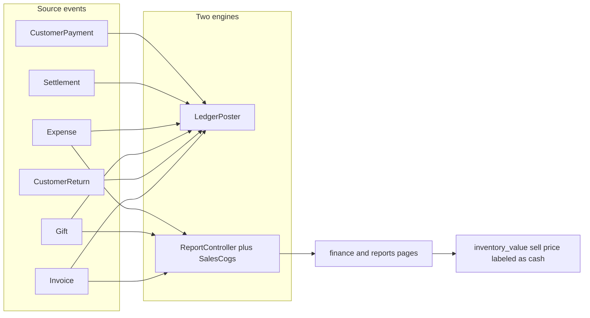

# Finance remediation plan

Status: **Phase 0 docs approved.** Agent implementation of T1–T7 is authorized but currently **blocked until agent mode is accepted** (plan mode cannot write PHP/migrations). T8/T9 remain **stopped for review**.

Related: [ACCOUNTING_RULES.md](ACCOUNTING_RULES.md), [FINANCE_API_CONTRACTS.md](FINANCE_API_CONTRACTS.md), [BUSINESS_ASSUMPTIONS.md](BUSINESS_ASSUMPTIONS.md).

## Phase 0 baseline (2026-08-18)

### Git

- Branch: `main` at `7e590f5` (`fixing overlall problems and logics`)
- Untracked (ignored for this work): `almanahel.zip`, `almanahel/`, `deployment/`

### Backend

- `php artisan test`: **34 passed** (142 assertions), 0.93s
- `php artisan migrate:status`: all ran through `2026_08_16_100001`; **`2026_08_17_200001_make_books_author_nullable` is Pending** on this local DB (not part of finance work)
- Pre-change suites: Auth, Characterization, Integrity, Ledger (1 test), Settlement (1 test), Stock lots

### Frontend

- `npx tsc --noEmit`: **clean** (exit 0)
- `npm run lint`: **102 errors, 16 warnings** (118 problems). Baseline; do not claim lint success. New work must not add errors on touched files.
- `NEXT_PUBLIC_API_URL=https://dar-almanahel.com/api npm run build`: **success** (SSG). `next.config.ts` does **not** ignore ESLint or TypeScript during builds.

### Current accounting flow



### Confirmed defects

| ID | Defect | Evidence |
|----|--------|----------|
| D1 | Cash KPI is inventory sell value | `frontend/src/app/[locale]/dashboard/finance/page.tsx` uses `inventory_value_*` |
| D2 | Reports bypass ledger | `ReportController` sums invoices/expenses/gifts |
| D3 | Returns restate sale-month COGS | `SalesCogs::fromAllocations` nets `quantity_returned` on invoice date |
| D4 | Archived expenses included; expense edits stuck | ReportController has no `archived_at` filter; `ExpenseController` reverse+`expense_replacement` unique key |
| D5 | Consignment sale credits inventory | `LedgerPoster::postSale` always Cr `inventory_asset` |
| D6 | Gifts/settlements use live 10% commission | `ConsignmentFinance::publisherShare` |
| D7 | Settlement field mismatch | Preview `items[]` has `kind/open_qty`; UI expects `title/qty_sold` |
| D8 | Bulk: lifetime debt vs period | `BulkSettlementPanel` |
| D9 | Combined cash/bank account | `LedgerPoster::cashAccount` |
| D10 | Credits mark paid without payment | `InvoiceController::updateCredit` |
| D11 | Iraq invoice-level + mixed FX | `ReportController::iraqProfit` |
| D12 | Top books mix currencies | `ReportController::topBooks` |
| D13 | Reconcile only debit=credit | `ledger:reconcile` |
| D14 | `all-branches.pending_credit` adds Toman+Dinar | `ReportController` ~100 |

## Locked product decisions

1. **Option B payable:** new receipts stamp `full_unit_cost` / rate `1.0` at intake. Optional `effective_at` is metadata, **not** a behavior switch.
2. **Allocation snapshots** are the payable source of truth (not live receipt/lot/config).
3. **Settled history:** snapshot inferred legacy amounts; never rewrite settlement rows.
4. **Unsold remaining + future sales** on mixed receipts use full unit cost from the lot stamp.
5. **Open unpaid/partial:** remaining = full-cost payable(eligible qty) − actual settlement allocation sums.
6. **Dimensional `journal_lines`** + **typed `financial_accounts`** (multiple banks/drawers; corporate `branch_id` null).
7. **Contra-revenue** `sales_returns` for customer returns.
8. **`FINANCE_LEDGER_REPORTS_ENABLED=false`** until cutover list in ACCOUNTING_RULES §12.
9. **No auto deploy, no restatement `--apply` unless asked, no commit unless asked.**
10. Do not edit already-deployed migrations.
11. **T8** must not change methods already called by controllers. Preferred: unused `FinancialPostingService`. Switch atomically in T9.
12. **T9** updates **all** payable readers to allocation snapshots together. `ConsignmentFinance` is legacy fallback only for unstamped rows while the reports flag is false. Never mix 90% and 100% across screens.
13. Restatement writes only with **`--apply`**. Invoking the command with no flags is dry-run and must not write.
14. Global settlements (`branch_id` null) fund a **corporate default** cash/bank account, never `settlement_payments`.
15. Return COGS from immutable `customer_return_lot_allocations`, not mutable `quantity_returned`.

## Acceptance scenarios by phase

| Scenario | Phase |
|----------|-------|
| A accounting (purchase/sale P&L and inventory; not cash-session) | 1 |
| B return-period | 1 |
| C consignment sale payable | 1 |
| D consignment gift payable | 1 |
| E settlement journal (not P&L) | 1 |
| H expense journal versions | 1 |
| Immutable snapshots / mixed-history remaining 110 | 1 (T7 domain; T9 HTTP) |
| Basic snapshot settlement (preview/settle/balances) | 1 (T9) |
| A cash balance + L cash close | 2 |
| F partial credit payment | 3 |
| G incoming check | 3 |
| K post-settlement consignment return | 3 |
| Bulk stale preview | 3 |
| I two currencies | 4 |
| J Iraq mixed-origin | 4 |
| Trial balance / balance sheet | 4 |
| End-to-end A–L pack | 6 / final |

---

## Phase 1 — executable units

**Stop after T7 for review.** Do not implement T8/T9 until approved.

### P0-C Characterization (before T1)

- **Files:** `tests/Feature/Characterization/FinanceBaselineTest.php`
- **Action:** snapshot unsafe current APIs. Credit test name: `test_legacy_credit_status_endpoint_marks_paid_without_payment_allocation`. Comment that Phase 3 must replace this with the correct contract. Do not describe the assertion as desired product behavior.
- **Verify:** `php artisan test --filter=FinanceBaselineTest`
- **Must-have:** no production behavior change

### P1-T1 Journal versioning (schema + model guards)

- **Files:** `2026_08_18_110001_add_journal_entry_versioning.php`; `JournalEntry.php`
- **Action:** `status`, `version` default 1, `reversed_at`, `supersedes_entry_id`. Unique `(source_type, source_id, event_type, version)`. Backfill version=1. Guard: refuse updates to monetary/source/dimension fields; allow `status` / reversal linkage only. **Do not change LedgerPoster.**
- **Rollback `down()`:** if any `version > 1`, **throw**. Never delete/merge versions. Restore old unique only when every row is version 1.
- **Production:** never rollback this migration after versioned journals exist.
- **Verify:** `php artisan migrate --pretend`; existing tests still pass

### P1-T2 Journal line dimensions

- **Files:** `2026_08_18_110002_add_journal_line_reporting_dimensions.php`; `JournalLine.php` (immutable after insert)
- **Action:** nullable `branch_id`, `supplier_id`, `customer_id`, `origin_scope`, `stock_lot_id`, `sale_lot_allocation_id`
- **Done:** LedgerPoster still does not fill them

### P1-T3 Payable snapshots (schema)

- **Files:** `2026_08_18_110003_add_payable_snapshots_to_allocations.php`
- **Action:** snapshot columns on sale/gift allocations, lots, receipts; optional copies on settlement_allocations **without changing `amount`**
- **Must-have:** `SettlementPayableTest` still expects **180000** until T9

### P1-T3b Customer return lot allocations (schema, before T8)

- **Files:** `2026_08_18_110006_create_customer_return_lot_allocations.php`; `CustomerReturnLotAllocation`
- **Columns:** `customer_return_id`, `customer_return_item_id`, `sale_lot_allocation_id`, `stock_lot_id`, `quantity`, `unit_cost`, `currency`, `ownership_type`, `supplier_id` nullable, `payable_basis`/`payable_rate` nullable, `publisher_payable_reversed`, `unsettled_payable_reversed`, `settled_payable_reversed`, `origin_scope`, timestamps
- **Must-have:** controllers do not write until T9

### P1-T4 Financial accounts (multi-account)

- **Files:** `2026_08_18_110004_create_financial_accounts.php`; `FinancialAccount`; unused `FinancialAccountResolver`
- **Columns:** unique stable `code`; `branch_id` nullable; `currency`; `type`; `name`; `ledger_account_id`; `is_default`; `is_active`; bank metadata
- **Must-have:** multiple banks/drawers allowed; default uniqueness in **service**; missing default → `DomainException`; never invent a bank
- **Seed tests/local only:** corporate default cash + bank (`branch_id` null)
- **System ledger codes:** `owned_inventory`, `sales_revenue`, `sales_returns`, `cogs`, `operating_expense`, `gift_expense`, `customer_credit_liability`, `supplier_recoverable`, `trade_payable` plus treasury types. Unused by LedgerPoster until T8/T9
- **No cash_sessions**

### P1-T5 Business event dates

- **Files:** `2026_08_18_110005_add_financial_event_dates.php`
- **Action:** copy `created_at` into `sold_at` / `returned_at` / `paid_at`; nullable `cleared_at`/`bounced_at`. Controllers omit them until T9

### P1-T6 Config

- **Files:** `config/almanahel.php`; `.env.example` only
- **Action:** reports flag false; payable defaults full_unit_cost/1.0; `effective_at` metadata. **Keep live commission 0.1** until T9

### P1-T7 Unused `PayableSnapshot` service

- **Files:** `app/Services/Settlement/PayableSnapshot.php`; `tests/Feature/Settlement/PayableSnapshotTest.php`
- **Tests:** 2×100=200; legacy settled retains historical payable; unsold on same receipt uses full cost for future; 200 − 90 paid = remaining 110; config/cache cannot change stamped rows; Toman/Dinar separate; Money/BCMath only
- **Must-have:** not imported by controllers

### P1-T8 unused `FinancialPostingService` + P1-T8.1 hardening

Direct-service tests only. Controllers still call `LedgerPoster`. HTTP settlement remains 90% until T9.

T8.1: consignment COGS = snapshot payable; return splits `unsettled`/`settled`; treasury scope; typed posting from persisted rows; atomic reverse+replace; extra allocation FKs; `finance:bootstrap-accounts` (dry-run default); `finance:t9-preflight`; `FINANCE_POSTING_V2_ENABLED=false`.

T8.2: preflight reversal-chain invariants; replacement/supersede guards; invoice total + allocation completeness; checks_payable issuance policy; `financial_accounts.branch_id` restrictOnDelete; removed `was_supplier_payable_settled`.

### P1-T9 STOP — atomic wiring

Switch all source controllers together. Persist return lot rows. Stamp new receipts. **All payable readers** use `publisher_payable` snapshots (`PeriodSettlement`, `SupplierPayable`, supplier/consignment unsettled, preview/settle, gifts, finance supplier-debt). Unstamped fallback via `ConsignmentFinance` only while flag false.

Global settlement: `financial_account_id` or corporate default — never `settlement_payments`.

`PUT /credits` still legacy until Phase 3. Then `SettlementPayableTest` 200000 for new 2×100000 sales.

### P1-T10 Restatement (after T9)

```
php artisan finance:restate-consignment-payables
php artisan finance:restate-consignment-payables --format=json|csv --output=
php artisan finance:restate-consignment-payables --supplier= --branch= --currency=
php artisan finance:restate-consignment-payables --apply
```

Without `--apply`, **zero writes**.

### P1-T11 Phase 1 HTTP acceptance (after T9)

A accounting, B, C, D, E, H, snapshot settlement. Not F/G/I/J/K/L/bulk.

---

## Phase 2 — Cash sessions

`cash_registers` / `cash_sessions`. Scenarios A cash + L.

## Phase 3 — AR / AP / checks / bulk

Payment allocations, checks, PUT credits guard, K, bulk 409. Snapshot settlement already done in T9.

## Phase 4 — Ledger reports

P&L/TB/BS/Iraq/top-books. Flag still false.

## Phase 5 — Frontend

Typed contracts; `financial_account_id`; cash ≠ inventory.

## Phase 6 — Cutover

Dry-run by default / explicit `--apply`. No auto enable of ledger reports.

---

## Risks

- T1 unique index: `down()` must fail closed if `version > 1`.
- T8 in-place refactor would change live posting — forbidden.
- Mixed 90%/100% across screens if T9 readers are partial — forbidden.
- Local pending `make_books_author_nullable` is unrelated.
- Frontend lint 102/16.

## Rollback

1. Keep `FINANCE_LEDGER_REPORTS_ENABLED=false`.
2. Do not rollback journal versioning in production after versioned journals exist.
3. Restatement `--apply` is not reversed by `migrate:rollback`.

## Manual acceptance (final)

A–L automated; restatement default dry-run CSV reviewed; no production `.env` edit; no deploy from this workstream.
